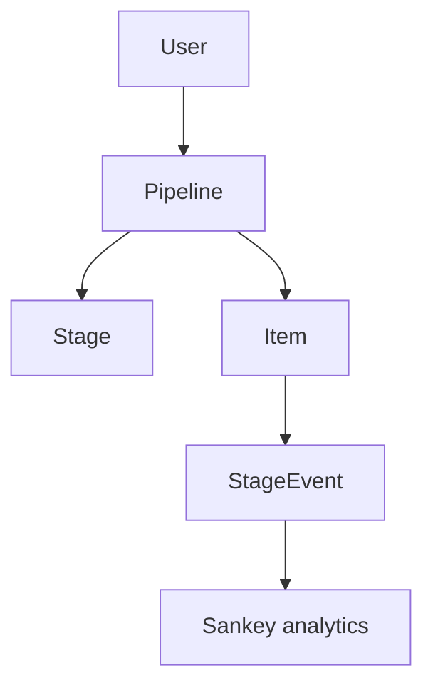

# Architecture

## Overview

Waypoint is a multi-user pipeline tracker. Users create **pipelines** from **templates**, add **items**, and move them through **stages**. Every stage change is logged as a **StageEvent** for analytics and Sankey visualization.

## Data model

| Entity | Purpose |
|--------|---------|
| `User` | Account (email + bcrypt password) |
| `Pipeline` | Named tracker instance (e.g. "2026 Job Hunt") |
| `Stage` | Ordered step in a pipeline (copied from template) |
| `Item` | Single tracked opportunity |
| `StageEvent` | Transition log (`fromStage` → `toStage`) |

Stages are **per-pipeline** rows, not a global enum. This allows job-search and sales pipelines to have different stage names while sharing the same engine.

## Auth flow

- **Auth.js v5** with JWT sessions and credentials provider
- Passwords hashed with **bcrypt** (12 rounds)
- `middleware.ts` protects all routes except `/login`, `/register`, and static assets
- All data queries scoped by `session.user.id`

## Server actions

| Action | File | Responsibility |
|--------|------|----------------|
| `registerUser` | `actions/auth.ts` | Create user |
| `createPipeline` | `actions/pipelines.ts` | Template → pipeline + stages |
| `createItem` | `actions/items.ts` | Item + initial stage event |
| `updateItemStage` | `actions/items.ts` | Append event, update current stage |

## Sankey pipeline

1. Fetch all `StageEvent` rows for a pipeline
2. Group by `(fromStage, toStage)` pairs
3. Map to ECharts `{ nodes, links }` via `lib/sankey/buildSankeyData.ts`
4. Render in client component `SankeyChart` (SSR disabled)

## Database access

Prisma 7 uses the **PostgreSQL driver adapter** (`@prisma/adapter-pg` + `pg`) in `lib/prisma.ts`. This is the supported pattern for serverless and container deployments.

## Docker

- **db:** Postgres 16 with healthcheck
- **app:** Dev image with volume mount + hot reload
- **app-prod:** Multi-stage standalone Next.js image
- **entrypoint:** `prisma migrate deploy` before start

## Security notes

- Row-level isolation via `userId` on pipelines
- Zod validation on all server action inputs
- `AUTH_SECRET` required in production
- `.env` never committed
