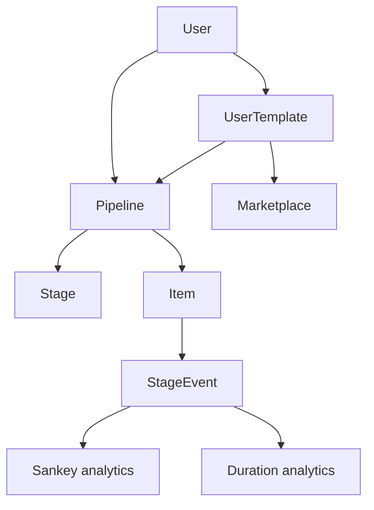

# Architecture

## Overview

Waypoint is a multi-user pipeline tracker. Users create **pipelines** from built-in or **user templates**, add **items**, and move them through **stages**. Every stage change is logged as a **StageEvent** for analytics and Sankey visualization.

A **template marketplace** lets users publish, copy, rate, like, and comment on shared stage flows. **Linked copies** stay in sync with the author via a sync wizard when stages change.

## Data model

| Entity | Purpose |
|--------|---------|
| `User` | Account (email + bcrypt password), default currency |
| `UserTemplate` | Reusable custom stage flow; can be public, forked, linked to source |
| `UserTemplateStage` | Stages defined on a user template |
| `TemplateLike` / `TemplateRating` / `TemplateComment` | Marketplace engagement |
| `Pipeline` | Named tracker instance; optional `userTemplateId`, `isArchived` |
| `Stage` | Ordered step in a pipeline (`isArchived` after template sync) |
| `Item` | Single tracked opportunity with template-specific `metadata` JSON |
| `StageEvent` | Transition log (`fromStage` → `toStage`) with `occurredAt` |

Built-in templates: `JOB_SEARCH`, `GRAD_SCHOOL`, `SALES`, `INVESTMENTS`, `CUSTOM` (user-template pipelines use CUSTOM).

## Auth flow

- **Auth.js v5** with JWT sessions and credentials provider
- Passwords hashed with **bcrypt** (12 rounds); change password in Settings
- `middleware.ts` protects all routes except `/api/auth`, static assets, favicon
- All data queries scoped by `session.user.id`

## Server actions

| Action | File | Responsibility |
|--------|------|----------------|
| `registerUser` | `actions/auth.ts` | Create user |
| `createPipeline` | `actions/pipelines.ts` | Template → pipeline + stages |
| `updatePipeline` | `actions/pipelines.ts` | Rename pipeline |
| `archivePipeline` | `actions/pipelines.ts` | Soft-hide pipeline from home |
| `deletePipeline` | `actions/pipelines.ts` | Permanent delete |
| `createItem` | `actions/items.ts` | Item + initial stage event |
| `updateItem` | `actions/items.ts` | Edit item fields and metadata |
| `deleteItem` | `actions/items.ts` | Remove item and events |
| `updateItemStage` / `moveItemToStage` | `actions/items.ts` | Append event, update current stage |
| `createUserTemplate` … | `actions/templates.ts` | Template CRUD, sync, unlink |
| `publishTemplate` … | `actions/marketplace.ts` | Marketplace social actions |
| `updateUserSettings` / `changePassword` | `actions/settings.ts` | Profile and security |

## Pipeline UX

- **Table view** — sortable, filterable item list with template-aware columns
- **Board view** — kanban columns per stage; drag-and-drop calls `moveItemToStage`
- **Item detail** — edit/delete, stage update form, timeline
- **Analytics** — Sankey flow, conversion stats, stage duration metrics, investment breakdown
- **CSV export** — `GET /api/pipelines/[id]/export`

## Analytics

1. Fetch `StageEvent` rows for a pipeline
2. **Sankey:** group by `(fromStage, toStage)` → ECharts via `lib/sankey/buildSankeyData.ts`
3. **Durations:** average days per stage, transition counts, time-to-terminal via `lib/analytics/durations.ts`
4. **Stats:** template-specific conversion labels via `lib/sankey/stats.ts`

## Marketplace

- Public templates browsed at `/marketplace` with search, min-stage filter, sort tabs
- Metrics: likes, copies, ratings, comments, **pipeline usage count**
- Copy as linked fork (auto-sync) or independent copy
- Sync wizard when author removes stages that contain items

## Database access

Prisma 7 uses the **PostgreSQL driver adapter** (`@prisma/adapter-pg` + `pg`) in `lib/prisma.ts`.

## Docker

- **db:** Postgres 16 with healthcheck
- **app:** Dev image with volume mount + hot reload
- **app-prod:** Multi-stage standalone Next.js image
- **entrypoint:** `prisma migrate deploy` before start

## Security notes

- Row-level isolation via `userId` on pipelines and templates
- Secrets in `~/.config/dev-setup/env` (never in git)
- Zod validation on all server action inputs
- `AUTH_SECRET` required in production
